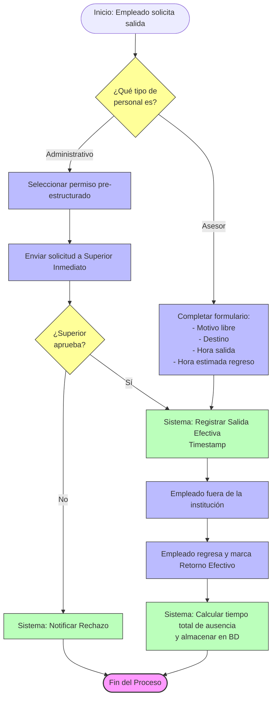

```mermaid
graph TD
    %% Definición de Estilos %%
    classDef inicioEnd fill:#f9f,stroke:#333,stroke-width:2px;
    classDef proceso fill:#bbf,stroke:#333,stroke-width:1px;
    classDef decision fill:#ff9,stroke:#333,stroke-width:1px;
    classDef sistema fill:#bfb,stroke:#333,stroke-width:1px;

    %% Flujo Principal %%
    Inicio([Inicio: Empleado solicita salida]) --> EvalRol{¿Qué tipo de<br>personal es?}:::decision

    %% Rama Administrativo %%
    EvalRol -- Administrativo --> SelForm[Seleccionar permiso pre-estructurado]:::proceso
    SelForm --> EnviarSup[Enviar solicitud a Superior Inmediato]:::proceso
    EnviarSup --> EvalSup{¿Superior<br>aprueba?}:::decision
    EvalSup -- No --> NotifRechazo[Sistema: Notificar Rechazo]:::sistema
    NotifRechazo --> Fin([Fin del Proceso]):::inicioEnd

    %% Rama Asesor %%
    EvalRol -- Asesor --> FormAsesor[Completar formulario:<br>- Motivo libre<br>- Destino<br>- Hora salida<br>- Hora estimada regreso]:::proceso

    %% Convergencia del Flujo %%
    EvalSup -- Sí --> RegistrarSalida[Sistema: Registrar Salida Efectiva<br>Timestamp]:::sistema
    FormAsesor --> RegistrarSalida

    RegistrarSalida --> Fuera[Empleado fuera de la institución]:::proceso
    Fuera --> Retorno[Empleado regresa y marca Retorno Efectivo]:::proceso
    Retorno --> CalcTiempo[Sistema: Calcular tiempo total de ausencia<br>y almacenar en BD]:::sistema
    CalcTiempo --> Fin
```

